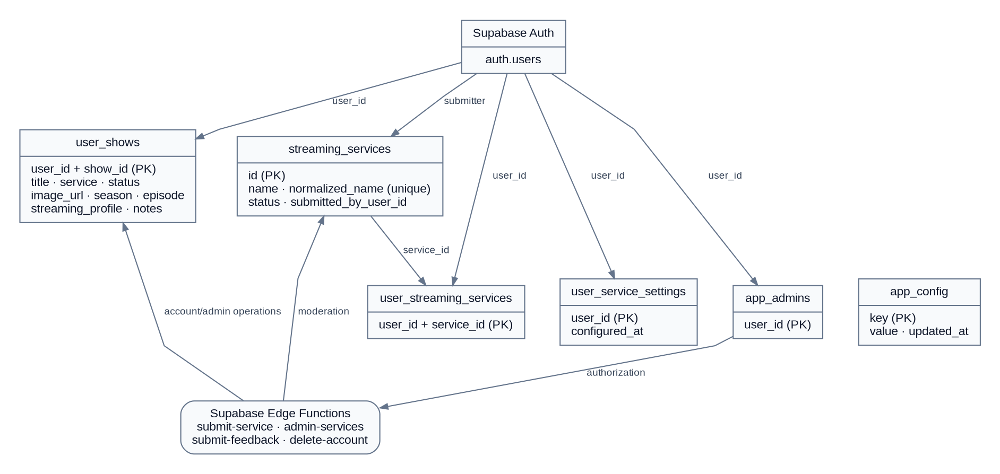
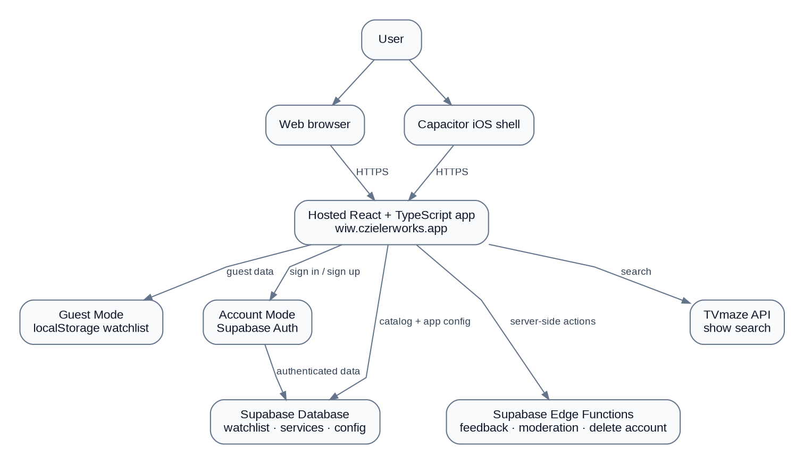
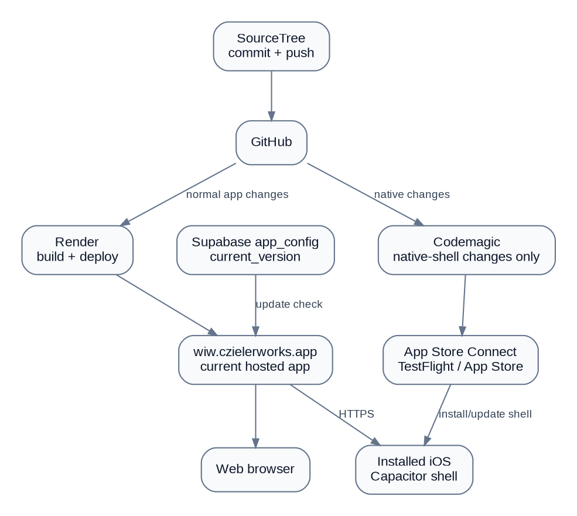

# Where I'm Watching --- Architecture & Workflow Guide

This document is a technical companion to the main README. It records
the current application architecture, Supabase data model, important
workflows, and the iOS/TestFlight release path.

## Architecture diagrams

-   [Database / backend schema](docs/images/database-schema.png)
-   [Application workflow](docs/images/application-workflow.png)
-   [Streaming-service moderation
    workflow](docs/images/service-moderation-workflow.png)
-   [Web / iOS release and version
    workflow](docs/images/release-workflow.png)

### Database / backend schema

The current backend uses Supabase Auth plus application tables for the
watchlist, streaming-service catalog and preferences, administrator
authorization, and app configuration. The repository migrations
explicitly define `streaming_services`, `user_streaming_services`,
`user_service_settings`, `app_admins`, and `app_config`. The application
also reads and writes `user_shows`.

### Application workflow

The React/TypeScript application supports two data paths: Guest Mode
stores the watchlist locally in the browser/device, while Account Mode
uses Supabase authentication and persistent user data. TVmaze supplies
show search results. Capacitor packages the same web application for
iOS.

### Streaming-service moderation

Known services are selected from the shared catalog. New service names
can be submitted for moderation. Signed-in users can continue using
their submitted service while it is pending, and administrators can
approve, merge, or reject submissions.

### Release and version workflow

The web bundle has an embedded `APP_VERSION`, while Supabase stores the
deployed version in `app_config` using `key = 'current_version'`.
`useAppVersion` reads that value and displays the update prompt when the
strings differ.

**Important:** version strings must use the same format. The current
source uses `1.2.0`; a database value of `1.2` is not equal to `1.2.0`
and will cause the update prompt to remain visible. For the current
build, set the database value to `1.2.0`, or update the comparison code
later to normalize semantic versions.

For iOS, Codemagic builds and uploads the Capacitor package to App Store
Connect, and TestFlight distributes it to testers. A browser refresh can
load a newly deployed web bundle, but a native iOS binary update must
come through TestFlight/App Store distribution. The native update UX
should therefore eventually be separated from the web refresh UX.

## Key project locations

-   `src/constants/appVersion.ts` --- embedded application version.
-   `src/hooks/useAppVersion.ts` --- Supabase version check and mismatch
    logic.
-   `src/components/system/VersionUpdatePrompt.tsx` --- update prompt
    UI.
-   `src/utils/nativeApp.ts` --- native app initialization.
-   `capacitor.config.ts` --- Capacitor app ID and iOS configuration.
-   `codemagic.yaml` --- iOS CI/build/upload workflow.
-   `supabase/migrations/` --- database migrations and RLS policies.
-   `supabase/functions/` --- Edge Functions.

## Current iOS release checkpoint --- September 3, 2026

App Store Connect record exists for **Where I'm Watching**. Codemagic
successfully uploaded iOS Version 1.2, Build 2. Export-compliance
questions were completed, the build became ready for TestFlight, an
internal testing group was created, and the app was successfully
installed on an iPhone through TestFlight.

The current issue found during TestFlight testing is the version-update
prompt. Source code uses `APP_VERSION = "1.2.0"` while Supabase was
changed to `1.2`. Because the current hook performs a direct string
comparison, those values still mismatch.

**Next release task:** make the version values match, verify the prompt
disappears, then adjust the update experience so native iOS builds do
not use the browser-only "Refresh" behavior for App Store updates.

**Additional TestFlight fix:** the Add Show streaming-service combobox no longer clears its query in the input `blur` handler. Clearing on blur could happen before a clicked dropdown option completed its selection, leaving the typed text visible but preventing the intended option from being recognized. The query is now cleared through the Headless UI Combobox `onClose` lifecycle instead, while the form value remains synchronized with typed text.

**Next release task:** create one new TestFlight build containing the hosted-server Capacitor configuration. After that build is installed, normal web-app releases can be delivered through Render without new TestFlight builds unless native-shell configuration or plugins change.

**Next release task:** build and test these fixes, then adjust the update experience so native iOS builds do not use the browser-only “Refresh” behavior for App Store updates.
