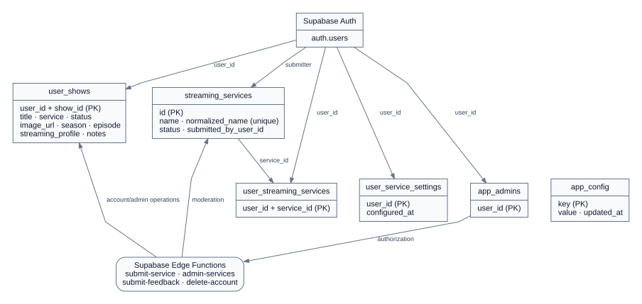
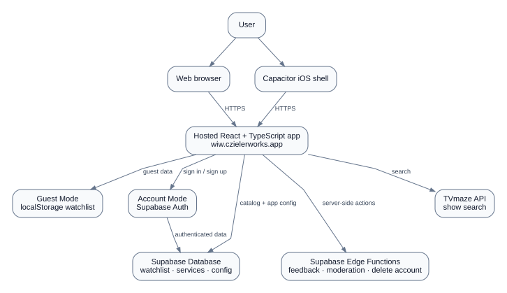
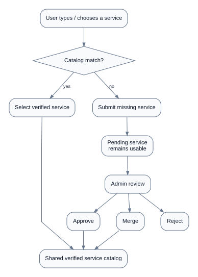
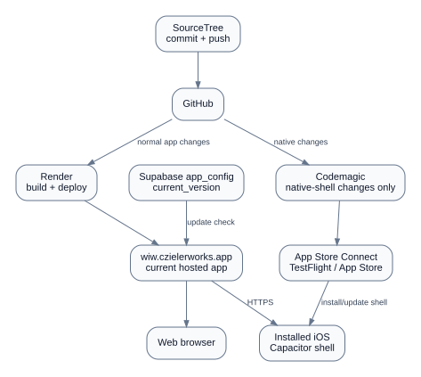

# Where I'm Watching — Architecture & Workflow Guide

This document is the technical companion to the main README. It reflects the current hosted-web + Capacitor architecture and the major Supabase workflows.

## Diagrams

- [Database / backend schema (SVG)](docs/images/database-schema.svg) · [PNG](docs/images/database-schema.png)
- [Application workflow (SVG)](docs/images/application-workflow.svg) · [PNG](docs/images/application-workflow.png)
- [Streaming-service moderation workflow (SVG)](docs/images/service-moderation-workflow.svg) · [PNG](docs/images/service-moderation-workflow.png)
- [Release / deployment workflow (SVG)](docs/images/release-workflow.svg) · [PNG](docs/images/release-workflow.png)

### Database / backend schema

Supabase provides authentication, persistent account data, the shared streaming-service catalog, app configuration, administrator authorization, and Edge Functions. Guest watchlists stay in local storage until a user signs in and chooses to migrate them.

### Application workflow

The production React/TypeScript app is hosted at `https://wiw.czielerworks.app`. Web users load it directly. The iOS Capacitor shell also loads that production URL, so ordinary React, TypeScript, styling, and business-logic updates can be delivered through the normal Render deployment without rebuilding the iOS binary.

### Streaming-service moderation

Users can select a known streaming service or submit a missing one. Submitted services enter the moderation workflow where an administrator can approve, merge, or reject them.

### Release / deployment workflow

Normal application changes are committed and pushed with SourceTree, then deployed through Render. A new Codemagic/TestFlight/App Store build is only required when the native shell changes—for example Capacitor configuration, plugins, permissions/entitlements, signing, icons/splash assets, or native code.

The app reads `app_config.key = 'current_version'` from Supabase. `useAppVersion` compares semantic-version components numerically and only reports an update when the running app version is older than the deployed version; `1.2` and `1.2.0` are treated as equivalent.

## Mobile watchlist table

On screens up to 700px wide, watchlist tables intentionally collapse to two columns:

- **Show Info** — artwork/title plus progress, streaming service, profile, and the notes expand control.
- **Actions** — edit and remove controls.

Desktop keeps the separate Show, Progress, Service, Profile, and Actions columns. Expanded notes and empty states span the full mobile table width.

## Key project locations

- `src/constants/appVersion.ts` — embedded application version.
- `src/hooks/useAppVersion.ts` — Supabase version check and semantic-version comparison.
- `src/components/system/VersionUpdatePrompt.tsx` — update prompt UI.
- `src/components/component-library/DataTable.tsx` — reusable table, responsive-column support, row expansion.
- `src/components/ShowList.tsx` — watchlist-specific desktop/mobile table presentation.
- `src/components/ServiceCombobox.tsx` — streaming-service selection/custom entry.
- `capacitor.config.ts` — Capacitor app ID, hosted production URL, and iOS settings.
- `codemagic.yaml` — native iOS CI/build/upload workflow.
- `supabase/migrations/` — database migrations and RLS policies.
- `supabase/functions/` — Edge Functions.
- `docs/IOS_DEPLOYMENT.md` — deployment rules for hosted web changes vs native-shell changes.
- `docs/diagrams/` — Graphviz source for the architecture diagrams.

## Current App Store checkpoint — September 3, 2026

- App Store Connect record exists for **Where I'm Watching**.
- The current hosted-mode iOS build has been tested successfully through TestFlight.
- Export compliance and internal TestFlight setup are complete.
- The iOS shell now loads `https://wiw.czielerworks.app`.
- The release is being polished for App Store submission, with the current focus on mobile watchlist presentation and App Store screenshots.

## Accessibility and repository hygiene

The current portfolio cleanup adds keyboard-visible focus states, accessible Headless UI dialogs for Add/Edit Show, confirmation dialogs, and the mobile navigation drawer, ARIA state/linkage for expandable FAQ content, and current-page navigation state. Unused starter/legacy components and assets were removed, and `.env.example` documents the public client configuration without committing secrets.
