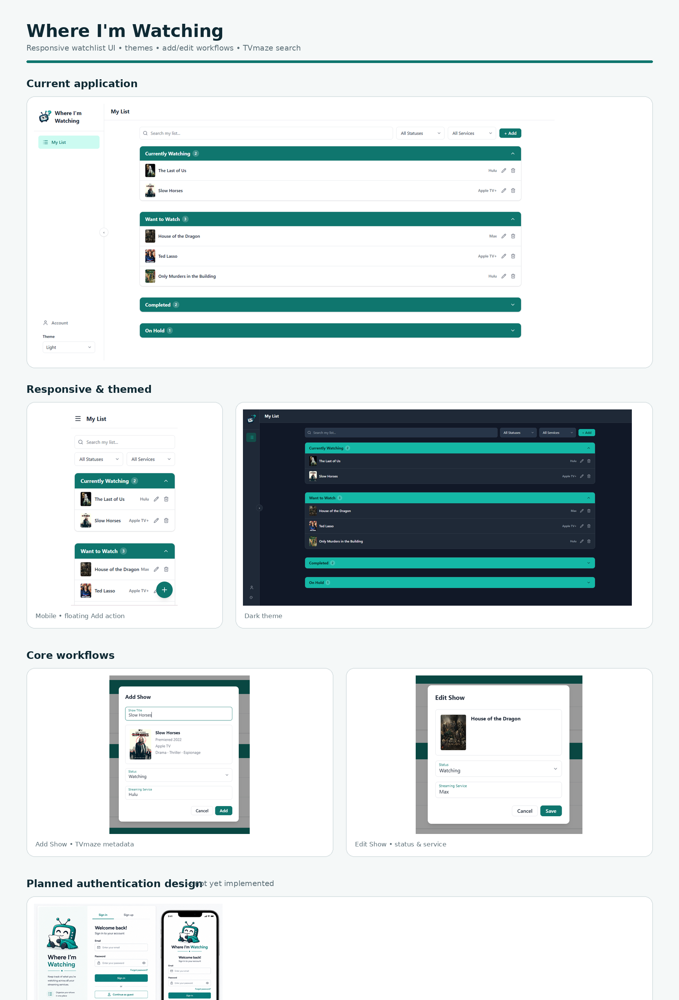

# Where I'm Watching

**Live:** https://wiw.czielerworks.app


A responsive React + TypeScript application for keeping track of TV shows across streaming services — including where you're watching them, which streaming profile you're using, and where you left off.



## Why I Built It

Where I'm Watching started with a simple problem: **Where was I watching that show again?**

Streaming libraries are spread across services, household members may use different profiles on the same account, and it is easy to forget where a show lives or which episode you reached. Where I'm Watching provides one place to keep that information together.

The project is also a hands-on exploration of modern React and TypeScript development, reusable component design, authentication, cloud-backed persistence, third-party APIs, transactional email, and production-minded account/privacy flows.

## Current Features

- Responsive desktop and mobile layouts
- Watching, Want to Watch, Completed, and On Hold lists
- Search and filtering by title and streaming service
- TV show lookup and metadata through the TVmaze API
- Debounced API search with artwork and metadata results
- Add, edit, move, and remove watchlist entries
- Season and episode progress tracking
- Streaming service and optional streaming-profile tracking
- Personal **My Services** preferences so Add Show prioritizes services a user actually has
- Last-used streaming service remembered when adding another show
- User-submitted streaming services with private/pending use before admin verification
- Guest custom services remain private to that browser while the full verified catalog stays available unless the guest explicitly customizes My Services
- Admin service moderation workflow: approve, merge duplicates, or keep a service private; approved services join the shared catalog for everyone
- Expandable per-show notes
- Light, Dark, and Blues themes with persisted preferences
- Guest Mode with local browser persistence
- Supabase account creation, sign in, sign out, and persistent sessions
- Cloud-backed watchlist storage for authenticated users
- Guest-to-account watchlist migration with duplicate handling
- Email confirmation and password-recovery flows
- Branded authentication email delivery through Resend
- Change-password support
- Download My Data JSON export
- Secure account deletion through a Supabase Edge Function
- Help & FAQ
- Bug reports, feature requests, and general feedback delivered through a Supabase Edge Function and Resend
- Consistent required-field and error-state styling
- Reusable account layouts, feedback forms, success states, dialogs, form controls, and data tables
- “Add another show” workflow for rapid list entry
- Database-backed app-version checking with a themed refresh prompt when a new deployment is available
- In-app **Coming Soon / Future Seasons** roadmap

## Tech Stack

- **React** + **TypeScript**
- **Vite**
- **Supabase** — authentication, PostgreSQL persistence, Edge Functions
- **Resend** — transactional authentication and support email
- **TVmaze API** — TV search and metadata
- **Tailwind CSS** + **SCSS** + CSS custom properties
- **Headless UI** — accessible combobox interactions
- **Lucide React** — icons
- **Capacitor** — native iOS packaging and device integration

## iPhone / Capacitor Development

The repository includes a generated Capacitor iOS project under `ios/` with
the bundle identifier `com.czielerworks.whereimwatching`.

After changing the React application, update the native project with:

```bash
npm run mobile:sync
```

On a Mac with Xcode installed, open the native project with:

```bash
npm run mobile:open
```

In Xcode, select an Apple Development team under **Signing & Capabilities**,
choose an iPhone simulator or connected device, and run the `App` scheme.

The iOS wrapper includes safe-area padding, native status-bar handling, and a
custom authentication callback URL. Add the following redirect URL to the
Supabase project's **Authentication → URL Configuration → Redirect URLs**:

```text
com.czielerworks.whereimwatching://auth/callback
```

Email confirmation and password-recovery requests automatically use this URL
inside the native app while continuing to use the deployed web origin in a
browser.

## Architecture & Technical Highlights

### Reusable Component Design

The application favors reusable components over page-specific duplication. Shared pieces include form controls, data tables, confirmation dialogs, account-page layouts, feedback forms, illustrated message states, and feedback success states.

A separate `component-library` project is maintained alongside Where I'm Watching. Reusable controls from that project are integrated here while application-specific components remain focused on product behavior.

### Guest and Account Modes

Guest users can use the core watchlist without registering; their data is stored in `localStorage`. Authenticated users persist their watchlist in Supabase so it can be accessed independently of a particular browser.

When a guest later signs in or creates an account, the application can migrate the local watchlist into the authenticated account while handling duplicates.

### Authentication & Account Lifecycle

Supabase Auth provides account creation, email confirmation, sign in/out, persistent sessions, and password recovery. Resend is configured as the custom SMTP provider for branded authentication emails.

The project also implements production-oriented account lifecycle features: password changes, downloadable account data, and secure account deletion. Account deletion is performed server-side by a Supabase Edge Function rather than exposing administrative credentials to the browser.

### Feedback & Support

Bug reports, feature requests, and general feedback share reusable React form/success components. Submissions are sent to a Supabase Edge Function, which uses a restricted Resend API key stored as a server-side secret to deliver messages to the application's support address.

### Data Tables & Watchlist State

A reusable table component provides collapsible status sections, column headers, expandable rows, and optional detail content. Where I'm Watching uses row expansion for notes so additional information remains available without permanently crowding the primary list.

Watchlist changes use immutable React state updates. Changing a show's status moves the updated entry between status collections while keeping the UI synchronized with the active persistence mode.

### Theming

CSS custom properties define semantic colors for backgrounds, surfaces, borders, text, accents, and interactive states. The selected theme persists in `localStorage`, and theme-aware assets can switch with the application's selected theme.

### TV Show Search

TVmaze powers show search and metadata. Requests are debounced to avoid sending an API call for every keystroke. Search results provide artwork and useful metadata while fallback states handle missing images.

### Streaming Profiles

In addition to recording a streaming service, a show can optionally record the profile used within a shared account. This addresses cases where multiple people share one Netflix/Hulu/etc. subscription but maintain separate viewing profiles.

### Streaming Service Catalog & Moderation

Version 1.1 separates the shared streaming-service catalog from each user's personal service preferences. Verified services are available to everyone, while users can immediately use a newly submitted service without exposing it globally. Guest users begin with the full verified catalog plus any browser-private custom services; the list narrows only after they explicitly change selections on My Services. Signed-in submissions are queued for admin review and can be approved, merged into an existing service, or kept private. Guest preferences stay in `localStorage`; account preferences sync through Supabase.

New service submissions trigger a server-side Resend notification so moderation does not depend on manually checking the database. Admin status is stored server-side rather than inferred from client-side configuration.

### Deployment Version Awareness

The frontend identifies itself with an application version while Supabase stores the currently deployed version in `app_config`. The app periodically checks the database and, when the versions differ, displays a themed **“A new season has been deployed”** refresh prompt. This prevents long-lived browser tabs from quietly remaining on stale frontend code.

## Project Structure

```text
src/
  components/
    account/             Account, privacy, help, and feedback UI
    component-library/   Reusable form and data-display controls
    layout/              Sidebar and mobile navigation
    watchlist/           Watchlist-specific controls
  hooks/                 Reusable React hooks
  lib/                   Supabase client configuration
  services/              External API integrations
  types/                 Shared TypeScript types
  utils/                 Shared utilities
supabase/
  functions/
    admin-services/      Admin moderation for submitted services
    delete-account/      Secure account/data deletion
    submit-feedback/     Server-side support email delivery
    submit-service/      Authenticated service submission + email alert
  migrations/            Versioned schema/data changes
```

## Development

Create a local `.env.local` containing the public Supabase values required by the Vite application. Secrets such as service-role credentials and Resend API keys belong in Supabase/Resend configuration and are **not** stored in the client repository.

```bash
npm install
npm run dev
```

Create a production build with:

```bash
npm run build
```

## Coming Next Season

The web app is live and Version 1.1 focuses on user-requested streaming-service personalization and production polish. The next planned season includes:

- Returning/new-season notifications for tracked shows
- Capacitor packaging for iPhone/iOS
- TestFlight and Apple App Store release work
- Android/Google Play packaging using the same React/Capacitor codebase
- Additional automated unit/component testing
- Accessibility, keyboard, and cross-browser regression testing

## Future Seasons

Longer-term ideas currently being explored include:

- Screenshot/photo import from streaming-service “Continue Watching” screens
- Direct streaming-service integrations where APIs and terms permit them
- Recommendation sharing by email/SMS with per-show notes
- Family/shared watchlists
- Movie tracking and broader media types
- User voting/interest signals for planned features
- Smarter metadata caching and refresh behavior

The in-app **Coming Soon** page gives users a lightweight view of planned work and points them to Feature Request when something they want is not already on the roadmap.

## Version 1.1 Supabase Setup

Version 1.1 adds database-backed streaming-service preferences, moderation, admin access, and deployment version awareness. Apply:

```text
supabase/migrations/20260901_v1_1_streaming_services.sql
```

Then add the desired authenticated user to `public.app_admins` using the commented SQL at the bottom of the migration. The repository intentionally does **not** hard-code an administrator email or user ID.

Deploy the two new authenticated Edge Functions:

```bash
supabase functions deploy submit-service
supabase functions deploy admin-services
```

`submit-service` reuses the existing `RESEND_API_KEY` and `SUPPORT_EMAIL` Supabase secrets. No API keys or service-role credentials belong in the client application.

When deploying a future frontend version, update `public.app_config.current_version` after the new build is live. Existing sessions will then receive the refresh prompt.

## Project Goals

Where I'm Watching is intended to be both a useful product and a portfolio-quality demonstration of modern front-end engineering: responsive UI, reusable component architecture, API integration, authentication, persistent application state, serverless functions, account/privacy workflows, and incremental refactoring as a product grows.

### V1.1 service-preference repair

If you tested an earlier pre-release V1.1 build, run `supabase/migrations/20260901_v1_1_service_settings_marker_fix.sql` once and redeploy the `submit-service` Edge Function. Earlier builds could incorrectly treat adding a custom service as an explicit My Services configuration and hide the rest of the verified catalog.

### Streaming-service auto-add behavior

- In Add Show, typing a service that already exists in the shared catalog automatically selects it for the user.
- Typing a brand-new service submits it to Pending Services for admin review.
- Guest users can submit new services for review too; the service remains usable locally while pending.
